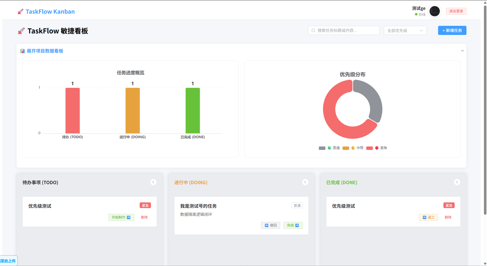
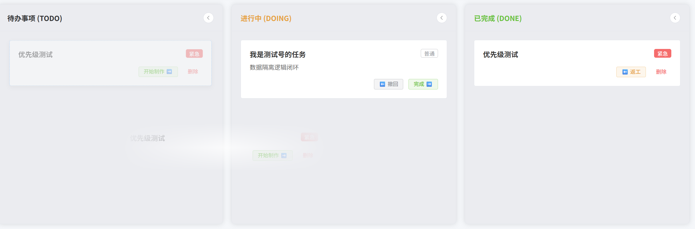
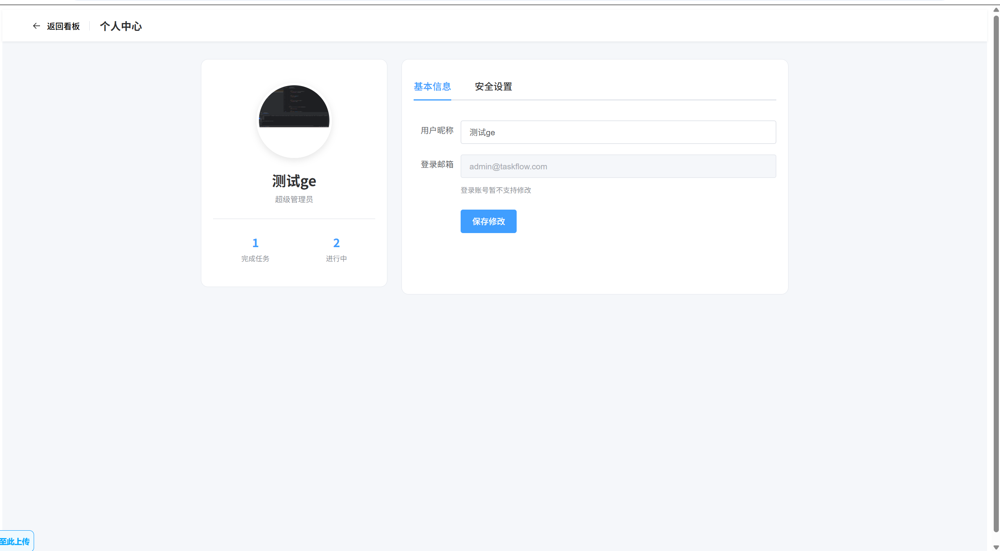

# 🚀 TaskFlow - 敏捷任务协同看板系统


TaskFlow 是一款基于 **Vue 3 + Spring Boot** 的轻量级、响应式全栈敏捷任务管理系统。通过直观的拖拽式看板和实时数据可视化，帮助个人和团队高效追踪任务进度，告别混乱，提升生产力。

---

## ✨ 核心特性 (Features)

- 📋 **可视化拖拽看板**: 提供 TODO（待办）、DOING（进行中）、DONE（已完成）三个维度的任务流转，支持丝滑的鼠标拖拽状态同步。
- 📊 **多维数据大屏**: 完美集成 Apache ECharts，提供任务进度柱状图与优先级分布饼图，支持跟随折叠面板自适应缩放（Resize）。
- 👤 **完整的用户体系**: 包含 JWT 登录鉴权、动态修改个人信息、安全修改密码，以及支持本地物理隔离的 **真实用户头像上传**。
- 🔍 **高效数据过滤**: 支持针对任务标题、内容的关键字检索，以及按照“普通/中等/紧急”优先级的快速筛选。
- 🎨 **现代化 UI 体验**: 基于 Element Plus 深度定制，包含悬浮动态遮罩、精美的状态标签（Tag）以及自适应的弹性布局（Flex）。

---

## 🛠️ 技术栈 (Tech Stack)

### 前端 (Frontend)
- **核心框架**: Vue 3 (Composition API / `<script setup>`) + Vite 构建工具
- **UI 组件库**: Element Plus
- **路由管理**: Vue Router 4
- **网络请求**: Axios (结合 JWT Token 拦截器)
- **数据可视化**: Apache ECharts 5

### 后端 (Backend)
- **核心框架**: Spring Boot (Java)
- **持久层框架**: MyBatis / MyBatis-Plus
- **数据库**: MySQL 8.0+
- **安全认证**: JWT (JSON Web Token) 无状态鉴权
- **文件存储**: 本地物理路径映射 (`WebMvcConfigurer` 静态资源放行)

---

## 🚀 快速启动 (Getting Started)

### 1. 环境准备
- **Node.js**: v16.0 或更高版本
- **Java**: JDK 8 / 11 / 17
- **数据库**: MySQL 8.0+
- **IDE**: IntelliJ IDEA / VS Code

### 2. 后端部署 (Spring Boot)
1. 在 MySQL 中创建数据库 `taskflow`。
2. 导入项目提供的 SQL 脚本文件，初始化 `user` 和 `task` 表（注意：`user` 表包含 `avatar` 字段）。
3. 使用 IDEA 打开 `taskflow` 目录。
4. 修改 `src/main/resources/application.yml` 中的数据库连接配置（用户名和密码）。
5. 运行 `TaskflowApplication.java` 启动后端服务（默认运行在 `http://localhost:8080`）。

### 3. 前端部署 (Vue 3)
1. 进入前端目录：
   ```bash
   cd taskflow-frontend
2. 安装依赖：
   ```bash
   npm install
   ```
3. 启动前端服务：
   ```bash
   npm run dev
   ```
4.浏览器访问 Vite 提供的本地地址（通常为 http://localhost:5173）。 

---

## 📸 系统截图 (Screenshots)
- **任务看板与大屏截图**

- **拖拽交互截图**

- **个人中心截图**


## 📌 核心项目结构 (Project Structure)
TaskFlow/
├── taskflow-frontend/        # Vue3 前端工程
│   ├── src/
│   │   ├── assets/           # 静态资源
│   │   ├── router/           # 路由配置 (index.js)
│   │   ├── views/            # 核心视图页面
│   │   │   ├── Login.vue     # 登录页
│   │   │   ├── Register.vue  # 注册页
│   │   │   ├── Board.vue     # 核心看版页 (含 ECharts)
│   │   │   └── Profile.vue   # 个人中心页
│   │   └── App.vue           # 根组件
│   └── vite.config.js        # Vite 代理配置 (解决跨域)
│
└── taskflow/                 # Spring Boot 后端工程
    ├── src/main/java/com/taskflow/backend/
    │   ├── config/           # 配置类 (JWT拦截器, WebMvc文件映射配置)
    │   ├── controller/       # 接口控制层 (Login, User, Task)
    │   ├── entity/           # 实体类 (User, Task, Result)
    │   ├── mapper/           # 数据库映射接口
    │   └── utils/            # 工具类 (JwtUtils)
    └── uploads/avatars/      # 用户上传的真实物理头像目录

## 🤝 致谢与支持

本项目作为全栈实战项目，从零到一实现了敏捷开发的闭环。感谢在开发过程中不断 debug 和探索的自己！
如果你觉得这个项目对你有帮助，欢迎点个 Star ⭐️ 支持一下！    
